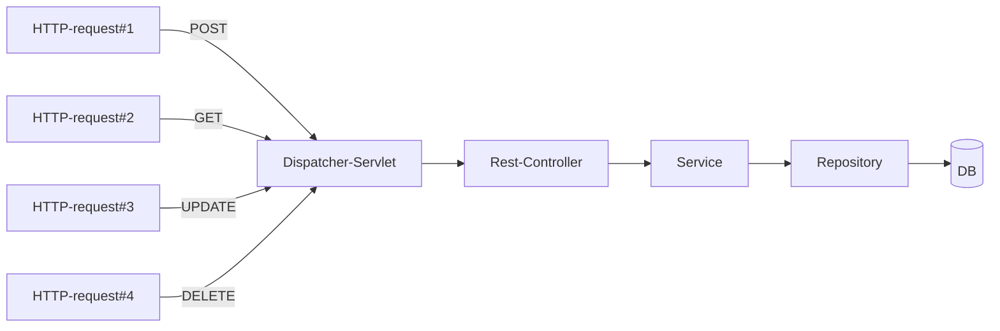
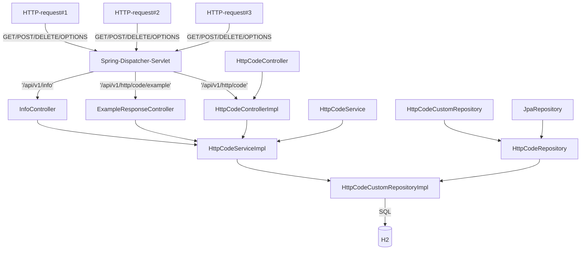

**Table of Contents**

# Intro

{TBD}

## The diagram of handling request

## The architecture of the application

## List of all Endpoints

# Dependencies
Make sure you have installed on your operating system: 
1. [JDK. Oracle](http://www.java.com/) OR [OpenJDK](https://openjdk.java.net/)
2. [Git](https://git-scm.com/)
3. [Maven](https://maven.apache.org/)

# Execution/Build

## Run Spring App.
`$> mvn spring-boot:run ` - command to start standalone application using Maven.

## Run tests
`$> mvn clean verify -Dtest.suite=before_artifact ` - it's start to execute unit/integration/mock test suite, before the building of application artifact. And generate Allure report log's 
`$> mvn clean verify -Dtest.suite=after_artifact ` - it's example of the standalone E2E test, what can be in the separate repo and can be tested application after deployment in the staging environment. 

## Reporting
`$> mvn allure:report `
If for some a reason you are not able to run tests, you can find example of the [report](./doc/allure-maven-plugin.7z) in the current project.

# Documentation

https://www.baeldung.com/spring-rest-openapi-documentation

Swagger: http://server:port/context-path/swagger-ui.html
OpenAPI: http://server:port/context-path/v3/api-docs

Swagger: http://localhost:7777/swagger-ui/index.html
# swagger-ui custom path
springdoc.swagger-ui.path=/swagger-ui.html

OpenAPI: http://localhost:7777/v3/api-docs
# /api-docs endpoint custom path
springdoc.api-docs.path=/api-docs

## References
* [Allure report](https://github.com/allure-framework)  An open-source framework designed to create test execution reports clear to everyone in the team. 
  > **_NOTE:_** To run the report (HTML + JS) in Firefox You need leverage the restriction by going to `about:config` url and then **uncheck** `privacy.file_unique_origin` **boolean** value.
* [Mermaid lets you create diagrams and visualizations using text and code.](https://mermaid-js.github.io/mermaid)
* [HTTP status codes description](https://www.restapitutorial.com/httpstatuscodes.html)
* [Mozilla.org - HTTP status codes description](https://developer.mozilla.org/en-US/docs/Web/HTTP/Status)
* [Spring. Rest examples](https://spring.io/guides/tutorials/rest)
* [Baeldung. Spring Boot H2 DB](https://www.baeldung.com/spring-boot-h2-database)
* [Baeldung. Spring. Response status](https://www.baeldung.com/spring-response-status)
* [Spring Boot H2 DB example](https://howtodoinjava.com/spring-boot2/h2-database-example)
* [Spring Boot. Code snippet#1](https://www.codegrepper.com/code-examples/whatever/responseentity+with+status+code+and+message)
* [Spring Boot. Code snippet#2](https://stackabuse.com/how-to-return-http-status-codes-in-a-spring-boot-application)
* [Baeldung. Spring Boot testing](https://www.baeldung.com/spring-boot-testing)
* [Baeldung. Spring test pyramid](https://www.baeldung.com/spring-test-pyramid-practical-example)
* [Baeldung. Spring. Mock MVC with Rest-Assured](https://www.baeldung.com/spring-mock-mvc-rest-assured)
* [Spring. Unit testing](https://allaroundjava.com/unit-testing-spring-rest-controllers-mockmvc/)
* [Spring. Code snippet#3](https://mkyong.com/spring-boot/spring-rest-validation-example/)
* [Spring. Code snippet#4](https://www.freecodecamp.org/news/unit-testing-services-endpoints-and-repositories-in-spring-boot-4b7d9dc2b772/)
* [spring Boot. Mockito JUnit, code snippet#4](https://howtodoinjava.com/spring-boot2/testing/spring-boot-mockito-junit-example/)
* [Spring Boot. Unit testing#1](https://blog.devgenius.io/spring-boot-deep-dive-on-unit-testing-92bbdf549594)
* [Spring Boot. Unit testing#2](https://reflectoring.io/unit-testing-spring-boot/)
* [Spring Boot. H2 DB unit test](https://www.tutorialspoint.com/spring_boot_h2/spring_boot_h2_unit_test_service.htm)
* [JUnit and mockito unit testing](https://medium.com/backend-habit/integrate-junit-and-mockito-unit-testing-for-service-layer-a0a5a811c58a)
* [Project Lombok](https://projectlombok.org/)
* [Oracle. Project Lombok](https://www.oracle.com/corporate/features/project-lombok.html)
* [Spring Doc/OpenAPI](https://springdoc.org/#getting-started)