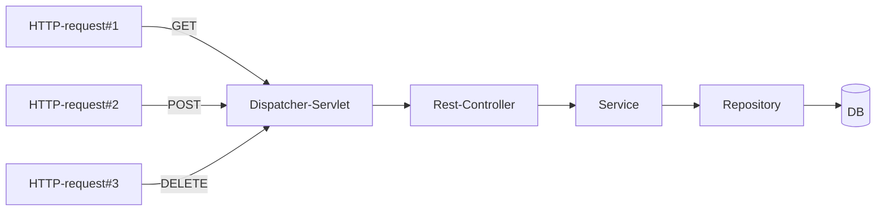
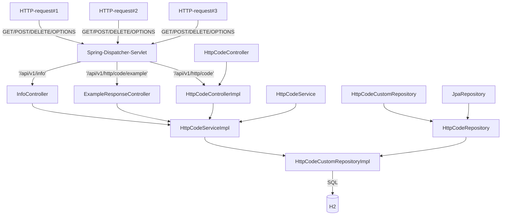

**Table of Contents**

## Run Spring App.
`$> mvn spring-boot:run`

## Run tests
`$> mvn clean -T3 verify -Dtest.suite=before_artifact` - it's start to execute unit test suite, before the building of application artifact. And generate Allure report log's</br>
`$> mvn clean -T3 verify -Dtest.suite=after_artifact` - it's </br>


## Reports
`$> mvn allure:report`

## Endpoints

```shell
$> mvn allure:report
```

# Diagram






# References
* [Mermaid lets you create diagrams and visualizations using text and code.](https://mermaid-js.github.io/mermaid)