# http-status-codes

## Dependencies
Make sure you have installed on your operating system:<br/>
1. [JDK. Oracle](http://www.java.com/) OR [OpenJDK](https://openjdk.java.net/)
2. [Git](https://git-scm.com/)
3. [Maven](https://maven.apache.org/)


## Run Spring App.
`$> mvn spring-boot:run ` - command to start standalone application using Maven.

## Run tests
`$> mvn clean verify -Dtest.suite=before_artifact ` - it's start to execute unit/integration/mock test suite, before the building of application artifact. And generate Allure report log's</br>
`$> mvn clean verify -Dtest.suite=after_artifact ` - it's example of the standalone E2E test, what can be in the separate repo and can be tested application after deployment in the staging environment.</br>

## Reporting
`$> mvn allure:report `
If for some a reason you are not able to run tests, you can find example of the [report](./doc/allure-maven-plugin.7z) in the current project.

**Swagger:** http://server:port/context-path/swagger-ui.html</br>
**OpenAPI:** http://server:port/context-path/v3/api-docs

___


# Context. It all depends on context!

## Intro

I have often been asking if I know REST API and if I can test API
(automation/manual). Do I have enough knowledge to write automated
tests?

I was stunned by such questions from the people reading my resume. At
first, I tried to do something with it: to say what I could answer
questions about the difference between PUT and PATCH, what status codes
exist, and what category they belong to, but alas - I think I could not
prove these people even the fact that I am a human being, which means I
can think and learn.

It's not about the resume; the point is that the employer wants to
confirm all the skills you have mentioned in your resume. Context is
very important!

I decided that arguing was ineffective, and I thought, why not write a
small demo showing my programming and testing skills?

The [GitHub project with source code](https://github.com/YuriiChukhrai/http-status-codes-demo)


## What is the idea behind the demo?

Write a REST API that will only do two things:

1. Display help information about the HTTP code of interest
(JSON/XML);

2. Simulate a response with the desired status code - for example,
you sent a request about the code 100 and received an HTTP response of
code 100 and its description.

And we will cover all this with tests: **unit** and **integration**. TestNG will
run all these tests (the major part of all examples in Internet - it's about the JUnit - it's one of the life mystery ),
and the results will be presented in Allure report (with attached request/response context).

It seems simple. And so we will briefly describe how all this will work
for us. We will need Spring Boot + Maven + TestNG + Rest-Assured.


## The diagram of handling request

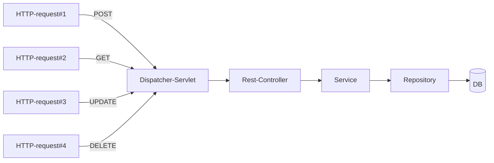
```mermaid
  graph LR;
      HTTP-request#1--POST-->Dispatcher-Servlet;
      HTTP-request#2--GET-->Dispatcher-Servlet;
      HTTP-request#3--UPDATE-->Dispatcher-Servlet;
      HTTP-request#4--DELETE-->Dispatcher-Servlet;
      Dispatcher-Servlet-->Rest-Controller;
      Rest-Controller-->Service;
      Service-->Repository;
      Repository-->DB[(DB)];
```
**_Pic#1_**. The handling of requests


## The architecture of the application
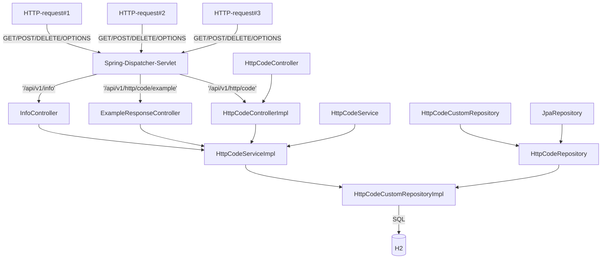
```mermaid
  graph TD;
      HTTP-request#1 & HTTP-request#2 & HTTP-request#3--GET/POST/DELETE/OPTIONS-->Spring-Dispatcher-Servlet;
      Spring-Dispatcher-Servlet--'/api/v1/info'-->InfoController;
      Spring-Dispatcher-Servlet--'/api/v1/http/code'-->HttpCodeControllerImpl;
      
      Spring-Dispatcher-Servlet--'/api/v1/http/code/example'-->ExampleResponseController;
      InfoController & ExampleResponseController-->HttpCodeServiceImpl;
      HttpCodeController-->HttpCodeControllerImpl;
      
      HttpCodeControllerImpl-->HttpCodeServiceImpl;
      HttpCodeService-->HttpCodeServiceImpl;
      HttpCodeServiceImpl-->HttpCodeCustomRepositoryImpl;
      
      HttpCodeRepository-->HttpCodeCustomRepositoryImpl;
      HttpCodeCustomRepository & JpaRepository-->HttpCodeRepository;
      HttpCodeCustomRepositoryImpl--SQL-->DB[(H2)];
```
**_Pic#2_**. The design of Spring-Boot application for [HTTP codes demo]


Incoming requests will be processed in REST controllers (annotation
**\@RestController**):

-   **InfoController** - provides general information about the project,
    the current version, and so on.

-   **HttpCodeControllerImpl** - CRUD (Create Read Update Delete)
    service for reference information on status codes.

-   **ExampleResponseController** - mimics the status code we need and
    gives information about it.

These controllers will call the service class
[**HttpCodeServiceImpl**] (**@Service** annotation), which will
process them according to business logic. If the service class needs to
interact with the database, it can do this through the
[**HttpCodeCustomRepositoryImpl**] class. This is additional
customization to the standard **JpaRepository** interface.

## Small context

Before diving into the details, let's go over the additional tools
we'll use. After creating the database, we need to fill it with some
information.

### 2.1 Flyway - SQL migration

Flyway is an open-source tool, that helps you implement automated and
version-based database migrations. It allows you to define the required
update operations in an SQL script or as Java code. Flyway detects the
required update operations and executes them.

So, you don't need to know which SQL update statements need to be
performed to update your current database. You and your co-workers just
define the update operations to migrate the database from one version to
the next. And Flyway detects the current version and performs the
necessary update operations to get the database to the latest version.

*Resource*: https://thorben-janssen.com/flyway-getting-started/

*Flyway integration (Maven/pom.xml):*
```mvn
<dependency>
    <groupId>org.flywaydb</groupId>
    <artifactId>flyway-core</artifactId>
    <version>${flyway.version}</version>
</dependency>
```

Here is how the configuration looks like:

1)  **flyway.enabled=true** - we enable this support in the Spring
    project (after adding the dependency to pom.xml);

2)  **flyway.locations=classpath:resources/db/migration** - specify the
    location of files for migration.

###  2.1.1 Flyway migration

The file name follows Flyway's default naming convention:
**V\<VERSION\>\_\_\<DESCRIPTION\>.sql**. This file contains the SQL
statements for database version 1 and Flyway will store it with the
description "create_database" in the SCHEMA_VERSION table.

This is how the files for SQL migration look like:

**. /src/main/resources/db/migration/V1_1\_\_create_http_codes_table.sql** -
contains instruction for creation of schemas;

**. /src/main/resources/db/migration/V2_1\_\_insert_http_codes_table.sql** -
fill the data in the tables.

### 2.2 Database (H2)

We will use [H2](http://www.h2database.com/html/quickstart.html) like a database. This DB uses the RAM
for storage - this is great for our purposes. It can be easily changed
to any other DB by changing the config in settings:

**spring.jpa.database-platform**</br>
**spring.datasource.url**</br>
**spring.datasource.driverClassName**</br>
**spring.datasource.username**</br>
**spring.datasource.password**</br>
**spring.h2.console.enabled**</br>

You can check/view the database when the project is running by following
the link ( **http://localhost:{port}/h2-console** )

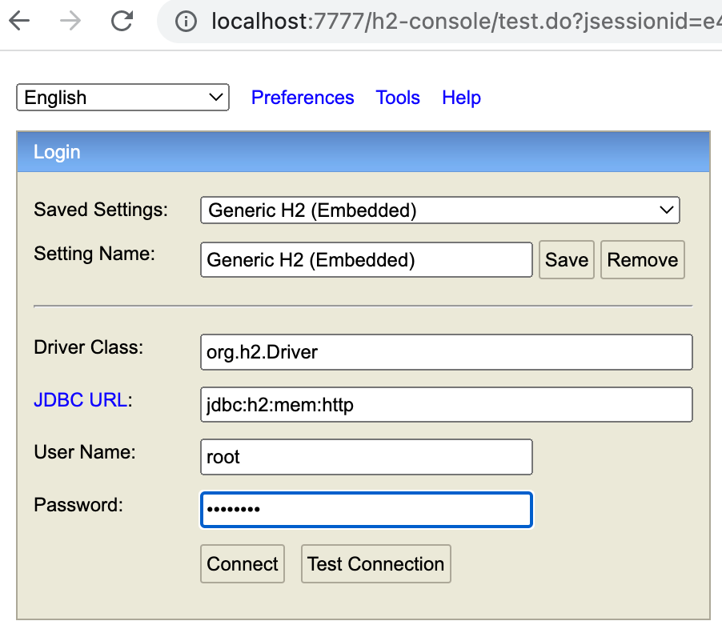
**_Pic#3_**. DB - Access to the H2 console in browser


![DB table [HTTP_CODE]](./doc/pic-h2-db.png)
**_Pic#4_**. Content of the DB table [HTTP_CODE] in H2


### 2.3 Lombok

Project Lombok is a mature library that reduces boilerplate code with
easy-to-use annotations. The library works well with popular IDEs and
provides a utility to "de-lombok" your code by reverting - that is,
adding back all the boilerplate that was removed when the annotations
were added. It can be useful for making your code more concise, reducing
the chance for bugs, and speeding up development time. The size of the
Java classes reduced significantly - just add annotation for your
Getters or Setters. Or we can use the Java record introduced in the JAVA
16 :).

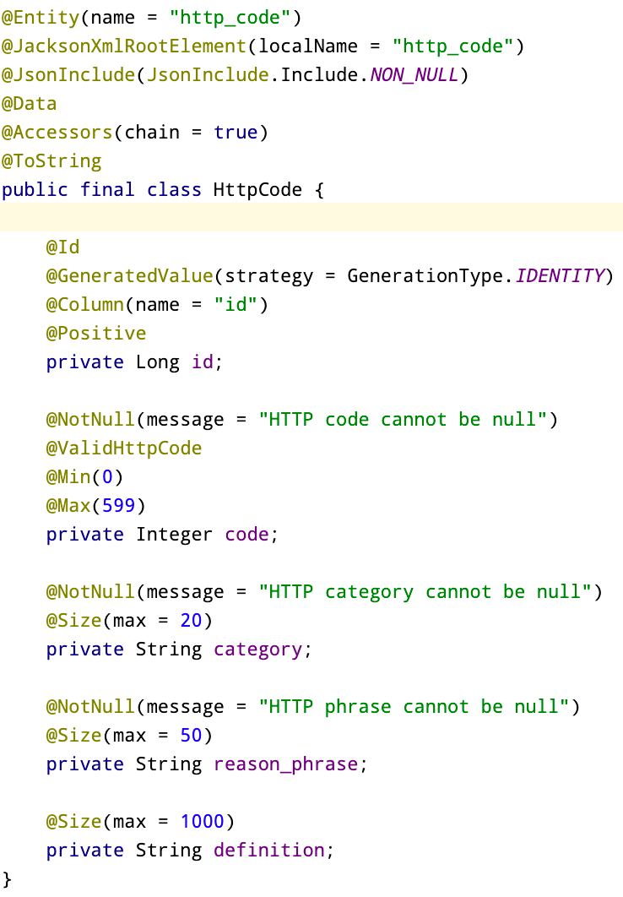
**_Pic#5_**. HttpCode entity/POJO/model representation with JPA and Lombok annotations

## More of Context.

For convenience, all examples will be given in
**MediaType.APPLICATION_JSON**, but the API supports XML too (don\'t
forget to specify **Accept: application/xml** in HTTP Headers). Let\'s
briefly describe each of the controllers.

### 3.1 InfoController

**a)** method: **Info getGeneralInformation()** - has no input
parameters and returns the fields with the description of the given
project (Info - response entity/POJO/model implemented by Java record).

**Request:**</br>
GET {uri}/api/v1/info</br>
Response (200 - OK):

```json
{
  "app_name": "HTTP status codes. Demo",
  "app_version": "0.0.1",
  "http_codes_size": 66,
  "dev": "Yurii Chukhrai",
  "e_mail": "chuhray.uriy@gmail.com",
  "git_hub_url": "https://github.com/YuriiChukhrai",
  "linkedin_url": "https://www.linkedin.com/in/yurii-c-b55aa6174",
  "swagger_url": "http://server:port/context-path/swagger-ui.html",
  "openapi_url": "http://server:port/context-path/v3/api-docs",
  "openapi_yaml_url": "http://server:port/context-path/v3/api-docs.yaml"
}
```

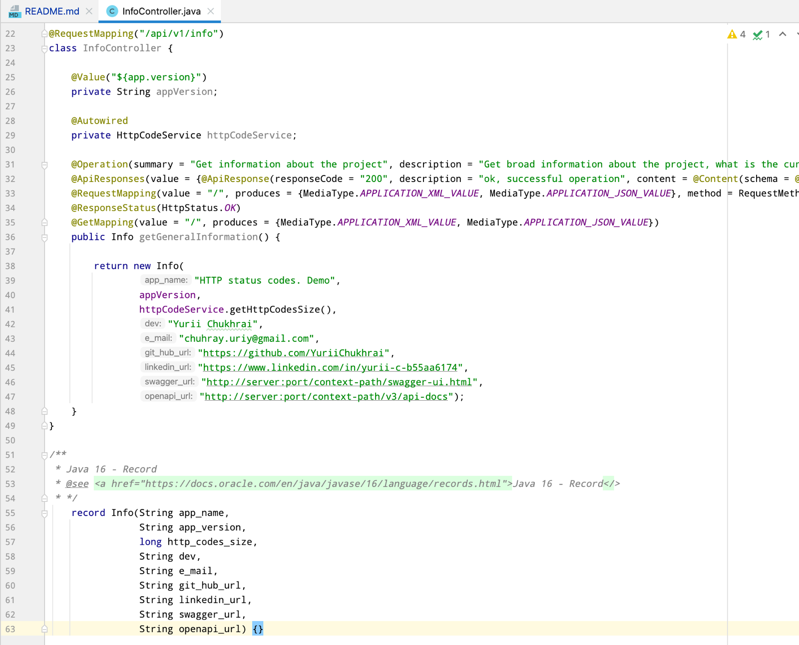
**_Pic#6_**. **InfoController** and Java Records for entity/POJO/model

### 3.2 HttpCodeControllerImpl

**a)** method: **HttpCode getHttpCodeByCode(Integer code)** - receives
the HTTP code of interest as input and returns the [HttpCode]
entity/POJO/model containing reference information about it. We will use
the CRUD (Create Read Update Delete) principle. I placed all the codes
that I could find here and here in the database
(V2_1\_\_insert_http_codes_table.sql), so let\'s start by looking at GET
(read). For example, I want to get information about status code 101:

**Request:**</br>
GET {url}/api/v1/http/code/info?code=101</br>
Response (200 - OK):</br>

```json
{
	"id" : 2,
	"code" : 101,
	"category" : "1** Informational",
	"reason_phrase" : "Switching Protocols",
	"definition" : "This code is sent in response to an Upgrade request header from the client and indicates the protocol the server is switching to."
}
```

**b)** method: **HttpCode getHttpCodeById(Long id)** - receives the ID
of the [HttpCode] model in the DB as input and returns the
[HttpCode] entity/POJO containing reference information about it.

**Request:**</br>
GET {url}/api/v1/http/code/3</br>
Response (200 - OK):</br>
```json
{
	"id" : 3,
	"code" : 102,
	"category" : "1** Informational",
	"reason_phrase" : "Processing",
	"definition" : "This code indicates that the server has received and is processing the request, but no response is available yet."
}
```

**c)** method: **List\<HttpCode\> getAllHttpCodes()** - does not receive
any input parameters - returns a collection of all available status
codes.

**Request:**</br>
GET {url}/api/v1/http/code/info/all</br>
Response (200 - OK):</br>
```json
[
	{
		"id" : 1,
		"code" : 100,
		"category" : "1** Informational",
		"reason_phrase" : "Continue",
		"definition":"This interim response indicates that the client should continue the request or ignore the response if the request is already finished."
	},
	{	
		"id" : 2,
		"code" : 101,
		"category" : "1** Informational",
		"reason_phrase" : "Switching Protocols",
		"definition" : "This code is sent in response to an Upgrade request header from the client and indicates the protocol the server is switching to."
	}
	....
]
```

The remaining methods will not be difficult to understand by their
names:
* **HttpCode saveHttpCode(HttpCode newHttpCode)** - create a new object [HttpCode] in DB
* **HttpCode putHttpCode(HttpCode newHttpCode, Long id)** - update a previously created object in the database
* **void deleteHttpCode(Long id)** - deleting an object from their database

### 3.3 ExampleResponseController


**a)** method: **ResponseEntity\<HttpCode\> getResponseEntityById**(Integer
code) - получает статус код, ответ которого надо симулировать, тело
ответа - справочная информация о статус коде.

**Request:**</br>
GET /api/v1/http/code/example/{code}<br>
Response (XXX - xxx: status code depends from input)</br>

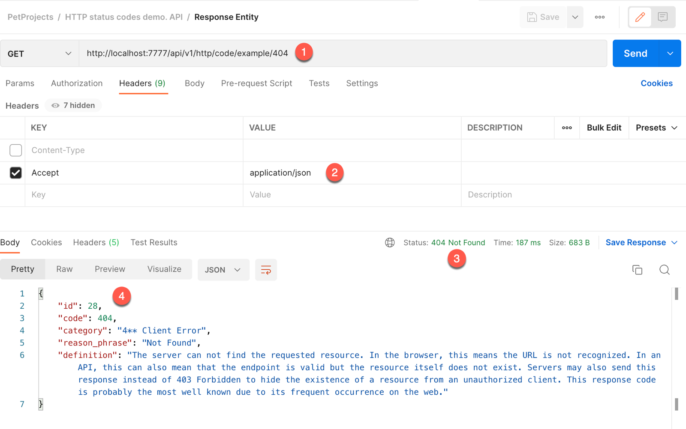
**_Pic#7.a_** (JSON) Response in Postman - ExampleResponseController#getResponseEntityById()

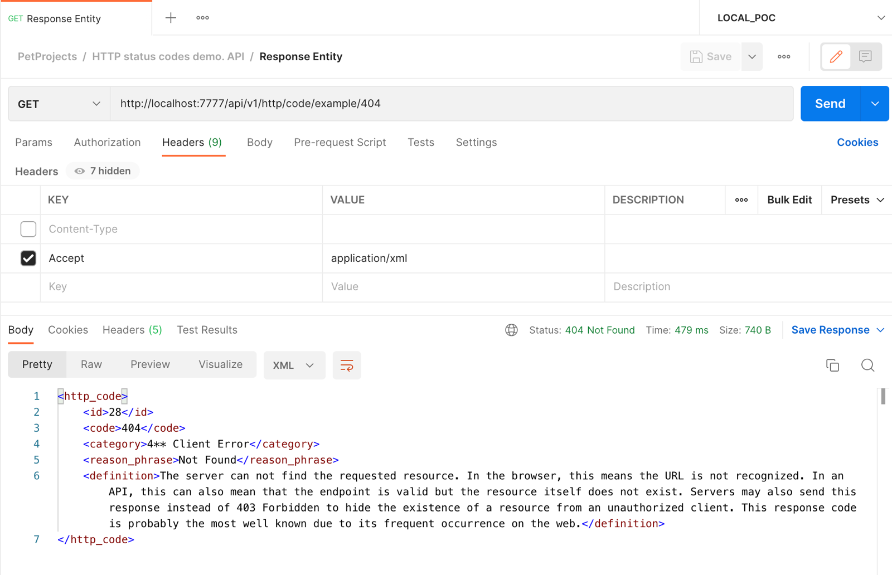
**_Pic#7.b_** (XML) Response of ExampleResponseController#getResponseEntityById()

### 3.4 Documentation

####  3.4.1 Spring Doc / Open API

SpringDoc - a tool that simplifies the generation and maintenance of
API docs based on the OpenAPI 3 specification for Spring Boot
applications. SpringDoc-OpenApi works by examining an application at
runtime to infer API semantics based on spring configurations, class
structure and various annotations. Automatically generates documentation
in **JSON/YAML** and HTML format APIs. This documentation can be completed
by comments using Swagger-api annotations.

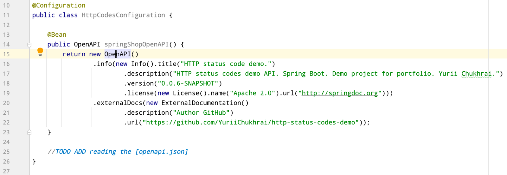
**_Pic#8_**. Spring Boot configuration Bean for OpenAPI documentation

The ability of APIs to describe their own structure is the root of all
awesomeness in OpenAPI. Once written, an OpenAPI specification and
Swagger tools can drive your API development further in various ways.

The **springdoc-openapi** dependency already includes Swagger UI, so we're
all set here.

We can simply access the API documentation at:

***URL (JSON):** http://localhost:7777/v3/api-docs*

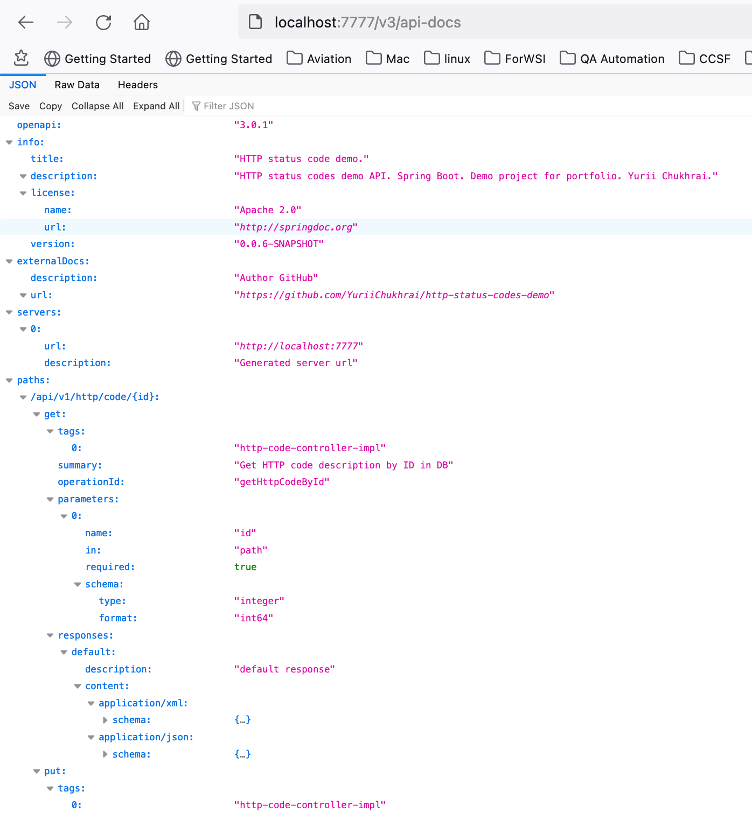
**_Pic#9_**. OpenAPI documentation JSON (it's how Mozilla parse JSON by
default)

Documentation can be available in YAML format as well, on the following
*path: /v3/api-docs.yaml*

***URL (YAML):** http://localhost:7777/v3/api-docs.yaml*

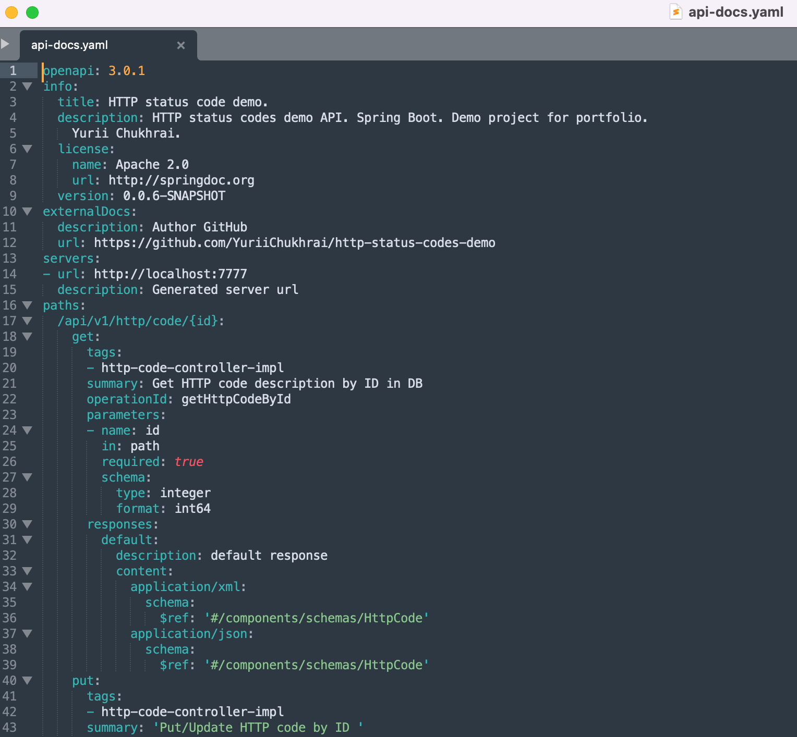
**_Pic#10_**. OpenAPI documentation YAML

###  3.4.2 Swagger UI

Swagger is a set of open-source tools built around the OpenAPI
Specification that can help you design, build, document and consume REST
APIs. Swagger UI - renders OpenAPI specs as interactive API
documentation. Use Swagger UI to generate interactive API documentation
that lets your users try out the API calls directly in the browser.

*URL: http://localhost:7777/swagger-ui/index.html*

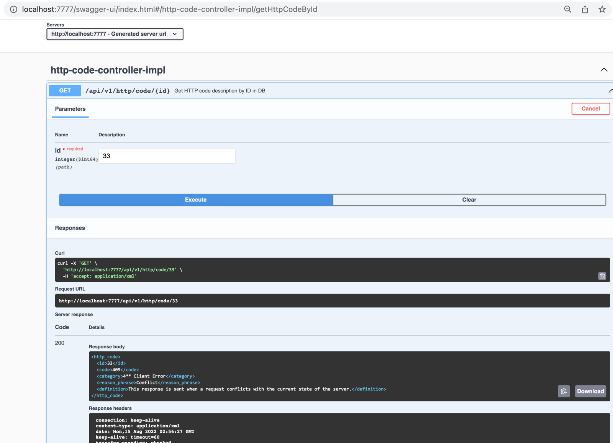
**_Pic#11_**. Swagger UI. Endpoint information


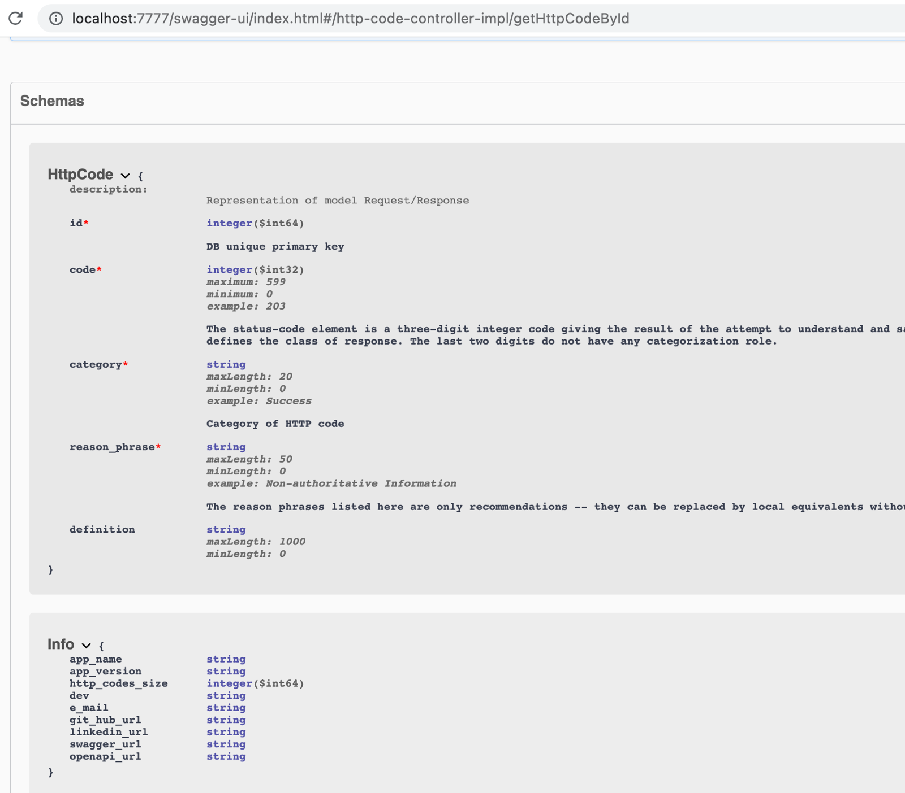
**_Pic#12_**. Swagger UI. Schemas descriptions

## IV. Test Coverage

### 4.1 Integration (E2E). Rest-Assured

The tests based on the Rest-Assured library. These tests represent E2E
and can be moved to the separate repository and be part regression
suite. Like you can see we start our Spring Boot application in the
method [**beforeSuite()**]. Rest-assured was designed to simplify the
testing and validation of REST APIs and is highly influenced by testing
techniques used in dynamic languages such as Ruby and Groovy.

**Location:** *core.yc.qa.test.e2e.InfoControllerTest*


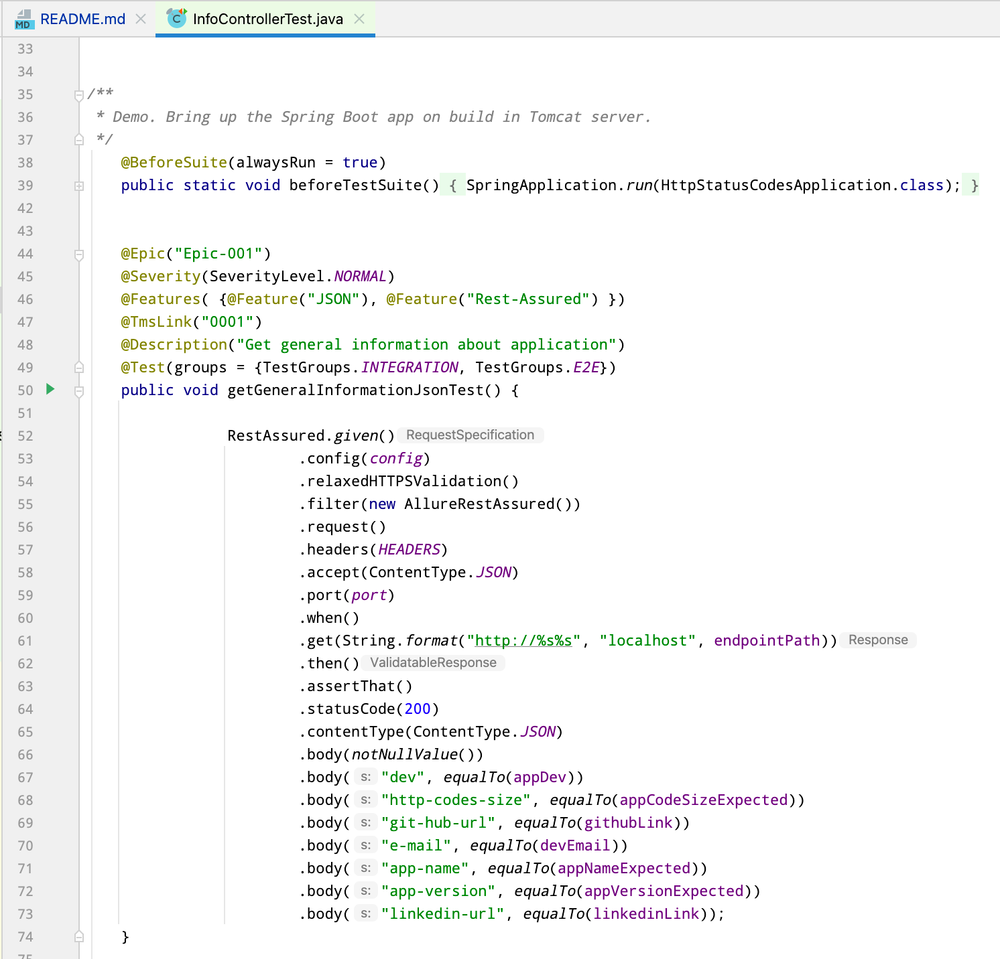
**_Pic#13_**. Spring Boot server + Rest-Assured

### 4.2 Integration (MockMVC)

These integration tests implemented using native Spring Boot tools like:
[**WebApplicationContext** and **MockMvc**] by using annotation for
autowire. The test implemented for **ExampleResponseController**
endpoints. It's you use the context include the up and running DB and
**MockMVC** to mock server requests/responses. **MockMVC** class is part
of Spring **MVC** test framework which helps in testing the controllers
explicitly starting a Servlet container. Tests with **MockMvc** lie
somewhere between unit and integration tests.

**Location:**
*core.yc.qa.test.integration.ExampleResponseControllerTest*

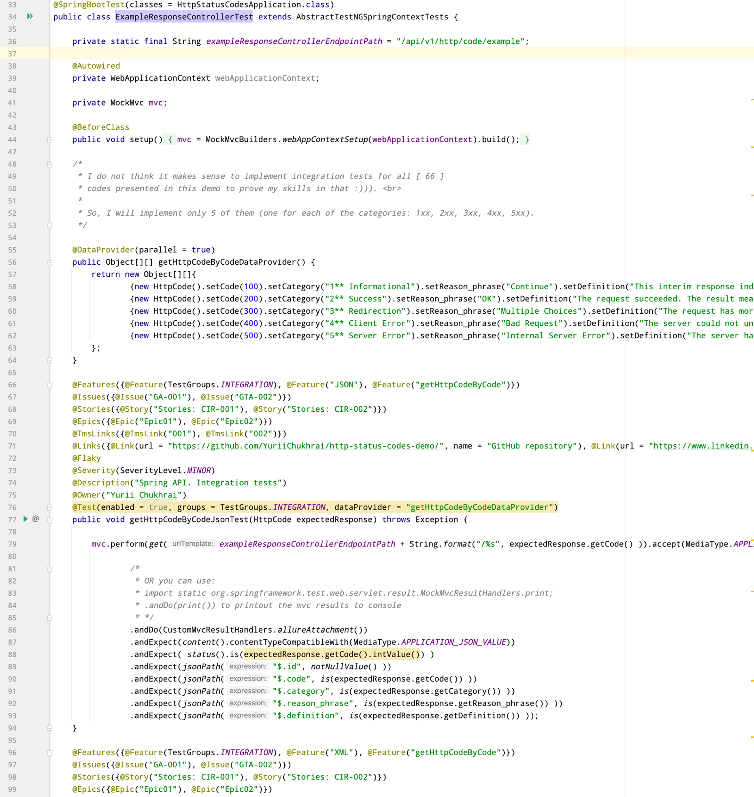
**_Pic#14_**. Spring Boot Test. MVC - ExampleResponseControllerTest

### 4.3 Integration (Mockito + MockMVC)

These integration tests implemented using native Spring Boot tools like:
[**WebApplicationContext** and **MockMvc**] by using annotation for
autowire. But we are not using real DB for that, instead of that I will
use the Mockito framework to mock all request related to the
[**httpCodeRepository**] (class - responsible to work with the DB)
and inject that behavior to [**httpCodeService**] class. Mockito is a
mocking framework, used for effective unit testing of JAVA applications.
Mockito is used to mock interfaces so that a dummy functionality can be
added to a mock interface that can be used in unit testing.

**Location:** *core.yc.qa.test.integration.mock.InfoControllerTest*

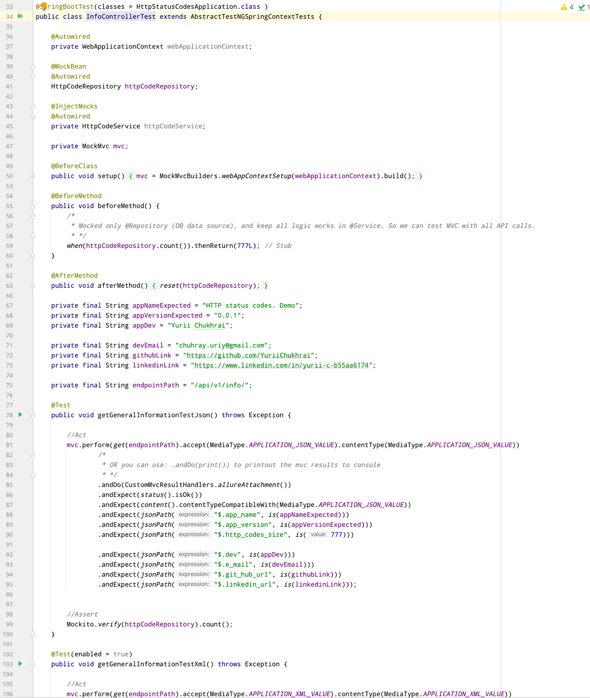
**_Pic#15_**. Spring Boot Test. Mockito + MockMVC - InfoControllerTest


### 4.4 Integration (Mockito only)

In this suite implemented examples of the pure Mockito tests without any
of the SpringBootTest/MockMvc injections - we will use the Mockito
listener [**MockitoTestNGListener.class**] for that. DB - will be
mocked - [**httpCodeRepository**] (class - responsible to work with
the DB) and [**httpCodeService**] class.

**Location:** *core.yc.qa.test.integration.mock.HttpCodeServiceImplTest*

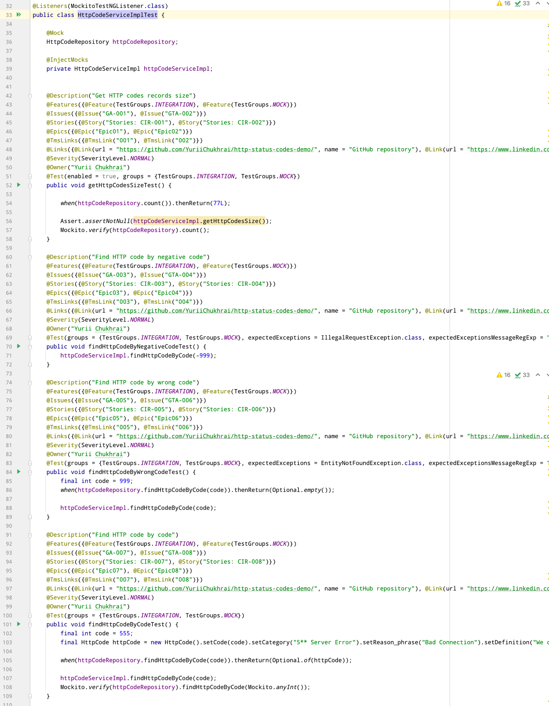
**_Pic#16_**. Mockito. HttpCodeServiceImplTest


### 4.5 Integration (Rest-Assured + WireMock)

These tests mostly like the E2E, implemented by using Rest-Assured test
framework. Instead of bringing up the real server I decided to provide
examples with WireMock library.

WireMock is an HTTP mock server. At its core it is web server that can
be primed to serve canned responses to requests (stubbing) and that
captures incoming requests so that they can be checked later
(verification).

This approach will allow you start develop your test automation base on
the specification, long before the dev will complete their part - be
more proactive.

**Location:**</br>
a)  *core.yc.qa.test.e2e.mock.HttpStatusCodeTest*</br>
b)  *core.yc.qa.test.e2e.mock.PersonTest*

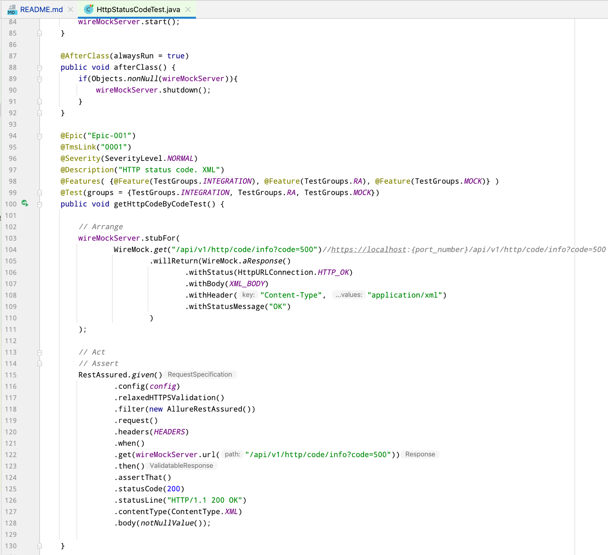
**_Pic#17_**. Rest-Assured + WireMock

## 4.6 Allure report

I love Allure. It's open source; it's beautiful; It has nice features
[Steps; Attachments; Links and Tms] - What also do you need for good
report and triage?

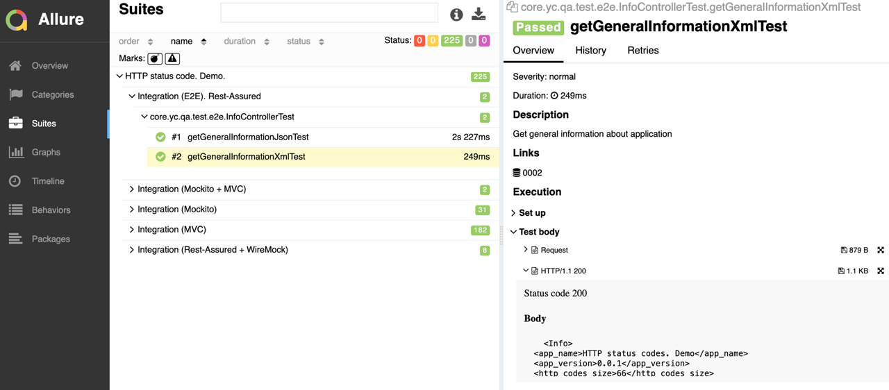
**_Pic#18_**. Allure report with all test suites and attachments (include the
MockMvc requests)


## References
* [Allure report](https://github.com/allure-framework)  An open-source framework designed to create test execution reports clear to everyone in the team.<br/>
  > **_NOTE:_** To run the report (HTML + JS) in Firefox You need leverage the restriction by going to `about:config` url and then **uncheck** `privacy.file_unique_origin` **boolean** value.
* [Mermaid lets you create diagrams and visualizations using text and code.](https://mermaid-js.github.io/mermaid)
* [HTTP status codes description](https://www.restapitutorial.com/httpstatuscodes.html)
* [Mozilla.org - HTTP status codes description](https://developer.mozilla.org/en-US/docs/Web/HTTP/Status)
* [Spring. Rest examples](https://spring.io/guides/tutorials/rest)
* [Baeldung. Spring Boot H2 DB](https://www.baeldung.com/spring-boot-h2-database)
* [Baeldung. Spring. Response status](https://www.baeldung.com/spring-response-status)
* [Spring Boot H2 DB example](https://howtodoinjava.com/spring-boot2/h2-database-example)
* [Spring Boot. Code snippet#1](https://www.codegrepper.com/code-examples/whatever/responseentity+with+status+code+and+message)
* [Spring Boot. Code snippet#2](https://stackabuse.com/how-to-return-http-status-codes-in-a-spring-boot-application)
* [Baeldung. Spring Boot testing](https://www.baeldung.com/spring-boot-testing)
* [Baeldung. Spring test pyramid](https://www.baeldung.com/spring-test-pyramid-practical-example)
* [Baeldung. Spring. Mock MVC with Rest-Assured](https://www.baeldung.com/spring-mock-mvc-rest-assured)
* [Spring. Unit testing](https://allaroundjava.com/unit-testing-spring-rest-controllers-mockmvc/)
* [Spring. Code snippet#3](https://mkyong.com/spring-boot/spring-rest-validation-example/)
* [Spring. Code snippet#4](https://www.freecodecamp.org/news/unit-testing-services-endpoints-and-repositories-in-spring-boot-4b7d9dc2b772/)
* [spring Boot. Mockito JUnit, code snippet#4](https://howtodoinjava.com/spring-boot2/testing/spring-boot-mockito-junit-example/)
* [Spring Boot. Unit testing#1](https://blog.devgenius.io/spring-boot-deep-dive-on-unit-testing-92bbdf549594)
* [Spring Boot. Unit testing#2](https://reflectoring.io/unit-testing-spring-boot/)
* [Spring Boot. H2 DB unit test](https://www.tutorialspoint.com/spring_boot_h2/spring_boot_h2_unit_test_service.htm)
* [JUnit and mockito unit testing](https://medium.com/backend-habit/integrate-junit-and-mockito-unit-testing-for-service-layer-a0a5a811c58a)
* [Project Lombok](https://projectlombok.org/)
* [Oracle. Project Lombok](https://www.oracle.com/corporate/features/project-lombok.html)
* [Spring Doc/OpenAPI](https://springdoc.org/#getting-started)